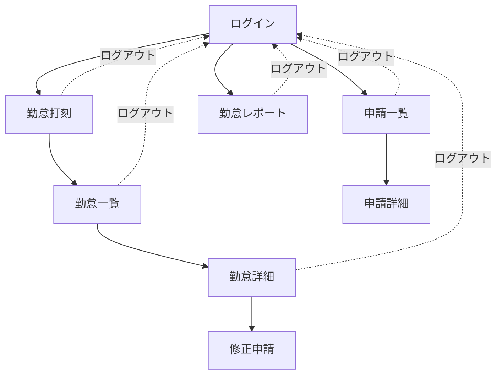
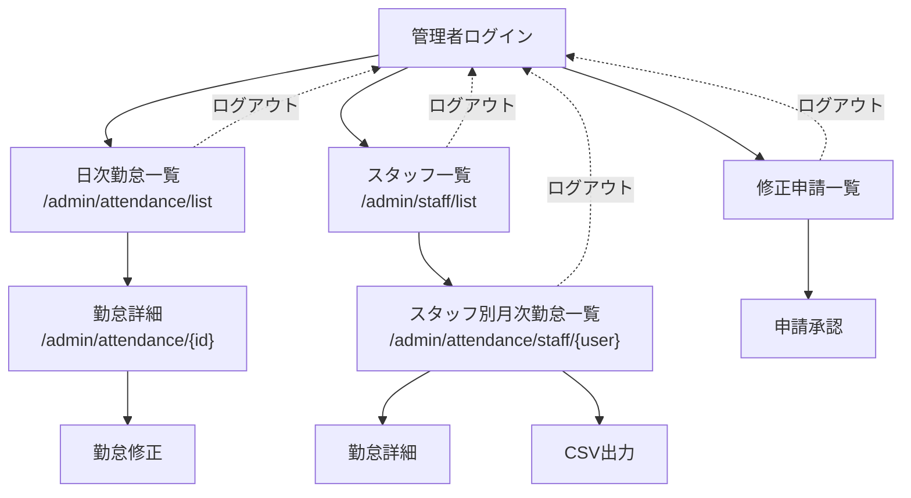

# 画面遷移図

## 一般ユーザー

```mermaid
flowchart TD

A[ログイン]
--> B[勤怠打刻]

B --> C[勤怠一覧]
C --> D[勤怠詳細]
D --> E[修正申請]

A --> F[申請一覧]
F --> G[申請詳細]

A --> H[勤怠レポート]

B -.ログアウト.-> A
C -.ログアウト.-> A
D -.ログアウト.-> A
F -.ログアウト.-> A
H -.ログアウト.-> A
```

## 管理者

```mermaid
flowchart TD

A["管理者ログイン"]
--> B["日次勤怠一覧<br>/admin/attendance/list"]

B --> C["勤怠詳細<br>/admin/attendance/{id}"]
C --> D["勤怠修正"]

A --> E["スタッフ一覧<br>/admin/staff/list"]
E --> F["スタッフ別月次勤怠一覧<br>/admin/attendance/staff/{user}"]

F --> G["勤怠詳細"]
F --> H["CSV出力"]

A --> I["修正申請一覧"]
I --> J["申請承認"]

B -.ログアウト.-> A
E -.ログアウト.-> A
F -.ログアウト.-> A
I -.ログアウト.-> A
```
